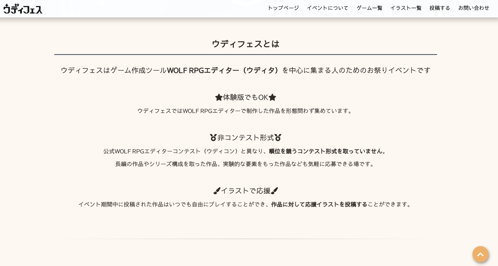
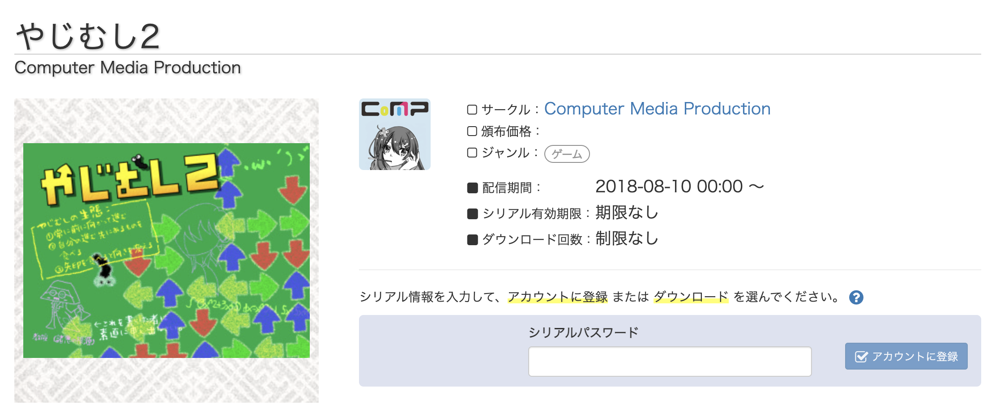
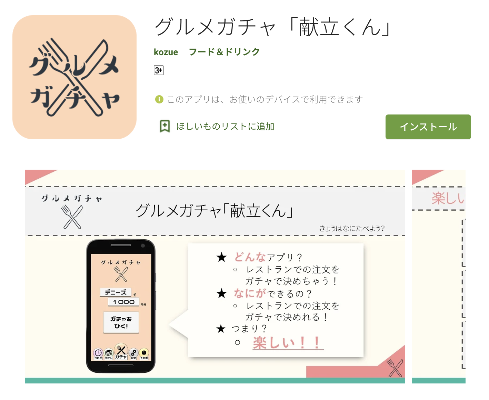

# 【経歴】

## 基本情報

| 項目       | 詳細                                                                       |
| ---------- | -------------------------------------------------------------------------- |
| 名前       | 大塚洋平                                                                   |
| 出身       | 広島県                                                                     |
| 高校   | 広島大学附属高等学校(2013-2016)                                            |
| 最終学歴   | 慶應義塾大学理工学部情報工学科(2016-2020)                                             |
| 所属       | 慶應義塾大学 大学院理工学研究科 開放環境科学専攻 修士１年(2021/1/20 現在) |

## 自己PRスライド
[こちら](自己PRスライド.pdf)から

## 概要

### プログラミング言語

| 言語             | 理解度    | 詳細     |
| ---------------- | --------- | -----|
| C#(Unity)              | ⭐️⭐️⭐️ | 主に Unity で使用。大学の研究でデジタルエージェントとの対話を設計するにあたってエージェントをUnityで開発した|
| Python           | ⭐️⭐️⭐️ | 研究で主に使用。チャットボットの開発なども行う。機械学習にも興味があり、KaggleやSignateなどのサービスを利用している|
| HTML・CSS(Scss)   | ⭐️⭐️    | ゲーム投稿サイトの運営メンバーの一人として活動している。主にフロントエンドの開発で用いる        |
| JavaScript(Vue.js)   |⭐️⭐️|上に同じく、ゲーム投稿サイトの開発で使用している|
| C           | ⭐️       | 大学の授業で触れたのみ。基本的な構文は扱える                                                    |
| Java           | ⭐️       | 大学の授業で触れたのみ。基本的な構文は扱える                                                    |
| SQL           | ⭐️       | 大学の授業で触れたのみ。基本的な構文は扱える                                                    |

### 主な開発環境
Visual Studio Code

# 【成果物】
## ゲーム投稿サイト

| 項目         | 詳細                                                             | 
| ------------ | ---------------------------------------------------------------- | 
| 概要         | ゲーム製作者から自作ゲームを投稿してもらうサイトの運営           | 
| URL          | https://wodifes.net/                                             | 
| 開発期間     | 半年(継続中)                                                     | 
| 使用した技術 | JavaScript(Vue.js), HTML, CSS                                    | 
| コメント     | 技術面は二人で分担していて、私は主にフロントエンドを担当している | 

## 落ちものゲーム

| 項目         | 詳細                                                             | 
| ------------ | ---------------------------------------------------------------- | 
| 概要         | サークルで作成した落ちものパズルゲーム。私が企画・実装を行い、サークルメンバーには絵と音楽を用意してもらった           | 
| 紹介動画      |  [こちら](https://twitter.com/comp_roduction/status/1025320356834205697)                                           | 
| 開発期間     | 半年                                                     | 
| 使用した技術 | WolfRPGエディター                           | 
| コメント     | コミックマーケットで50部頒布した | 

## Discord bot
| 項目         | 詳細                                                                            | 
| ------------ | ------------------------------------------------------------------------------- | 
| 概要         | 私が所属するDiscordサーバー内botの開発                                               | 
| 開発期間     | 一ヶ月                                                                          | 
| 使用した技術 | Python                                                                          | 
| 機能         | メンバーと挨拶・APIを利用して、自動的にオンラインゲームのスケジュールを表示     | 
| コメント     | このbotを作るにあたってherokuを活用して24時間サーバーを稼働させることができた | 

## デジタルエージェント
| 項目         | 詳細                                                                                                                                                 | 
| ------------ | ---------------------------------------------------------------------------------------------------------------------------------------------------- | 
| 概要         | 研究で使用した、等身大デジタルサイネージエージェントの視線動作設計                                                                                   | 
| 開発期間     | 一ヶ月                                                                                                                                               | 
| 論文URL      | 国際学会で発表した[論文](https://keio.pure.elsevier.com/ja/publications/predgaze-a-incongruity-prediction-model-for-users-gaze-movement)                             | 
| 使用した技術 | C#(Unity)                                                                                                                                            | 
| 機能         | 人間の視線を検知し、それに応じてエージェントの視線を操作                                                                                             | 
| コメント     | 顔認識(OpenFace)を用いて視線を取得した。 しかし、論文の締め切りもあり、顔認識の細かい実装についての理解が追いついていないため、今後把握していきたい。 | 

## Androidアプリ

| 項目         | 詳細                                                                                                               | 
| ------------ | ------------------------------------------------------------------------------------------------------------------ | 
| 概要         | 授業で作成したアンドロイドアプリ チェーン店のメニューをガチャで引くことができる                                 | 
| 開発期間     | 三ヶ月                                                                                                             | 
| URL          | https://play.google.com/store/apps/details?id=com.OhNiNi.GourmetGacha                                              | 
| 使用した技術 | C#(Unity)                                                                                                          | 
| コメント     | 三人のチーム開発を行った。 実装を行う技術面に加えて、チーム内での進捗を管理するマネジメントスキルを発揮できた。 | 

# 所有資格
基本情報技術者
- 2019年に自分の情報系知識の体系化を目的として受験。大学の授業では扱わないようなマネジメントや経営についての知識もつけることができた。
